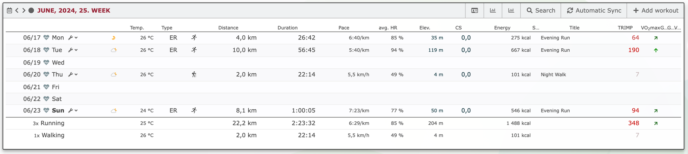
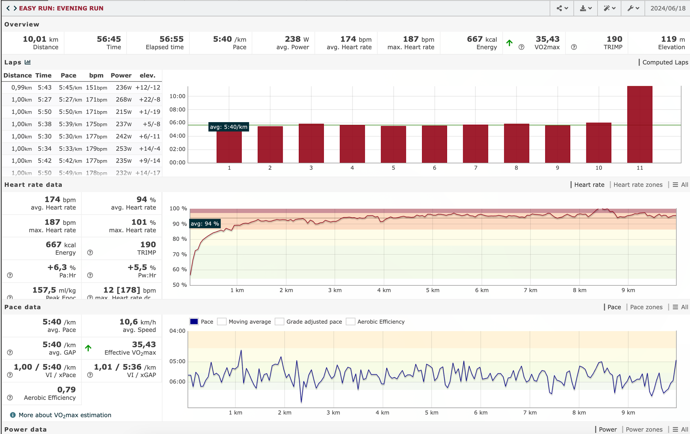
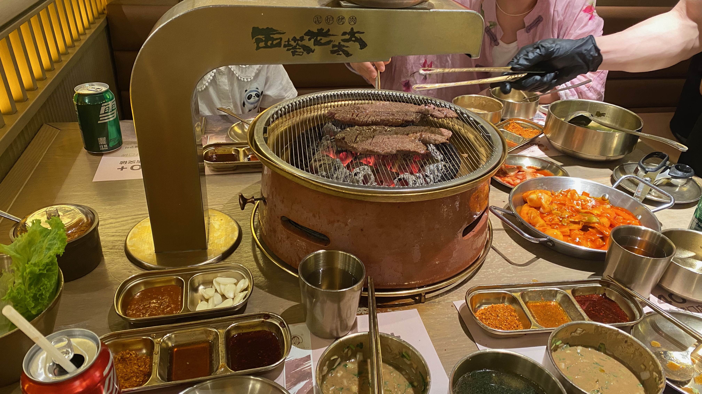

## 本周的运动数据

本周南京进入了梅雨季，伴随而来的就是阴雨绵绵的闷热天气，闷热的天气和湿漉漉的地面不得不减少本周的跑步次数。但是，即使天气再怎么炎热，也有不惧怕辛苦，仍然在闷热高温下进行训练。

## 周二的 10 km 测试

周二下班，来到玄武湖准备自测一个 10km，原先计划 50 分钟跑完全程，但是看了最近几次预测数据，提示 50 分钟对我来说比较困难（去年巅峰的时候压根不是事儿），于是我就将目标改成以 6 分钟的配速跑完全程，也就是跑完 10 km 要在 60 分钟内完成。

前面的 5 km 保持的还算不错，呼吸步频都在自己控制的范围，到了 6 km 的时候，明显觉得呼吸急促，步频也要降了下来，此时看了眼手表显示的数据，保持当前的速度能在 60 分钟内结束比赛。可以说，后面的 3 km 是靠自己的坚持跑下来的，依稀记得去年跑 10 km 还是很轻松的事情，中间停了数月的训练，再加上最近改变了步频，跑完 10 km 后整个人都累虚脱了，最终换来的成绩是 56 分钟跑完了 10km，配速为 5:40/km。

## 接下来的训练计划

后面可能会积累自己跑量，现在每周自己跑量只能在 15-20km 之间浮动，离明年跑全跑的计划要求差了很多，跑量的增加也是一个循序渐进的过程。大概就是先将自己跑量增加到 40km，维持 40 km 的跑量几周直至趋于稳定。后面再计划增加到每周 64 km。

每周 64 km 就需要一个科学的训练计划，不仅需要训练耐力也要提高自己步幅了。到那个时候，我可能也会找一个靠谱的教练，来指导自己。随着跑量上来，就不像现在这样没有目的的奔跑，后面需要训练多种配速来提高自己的整体水平，像耐力、无氧、间歇等。

## 生活碎片

周六，姐姐、姐夫、然然一起吃了一顿烤肉，这家店在南京算是人气比较旺的。中午我过去取号前面排了 17 桌，等了近 50 分钟才吃上。吃饭过程中，听服务员说到周六周日这家店的流水在 8 w 左右，非工作日也能做到 4 w，这样下来一年也有近千万的流水。饭后，带着然然去买了两个盲盒，其中一个拆出来她想要的。

